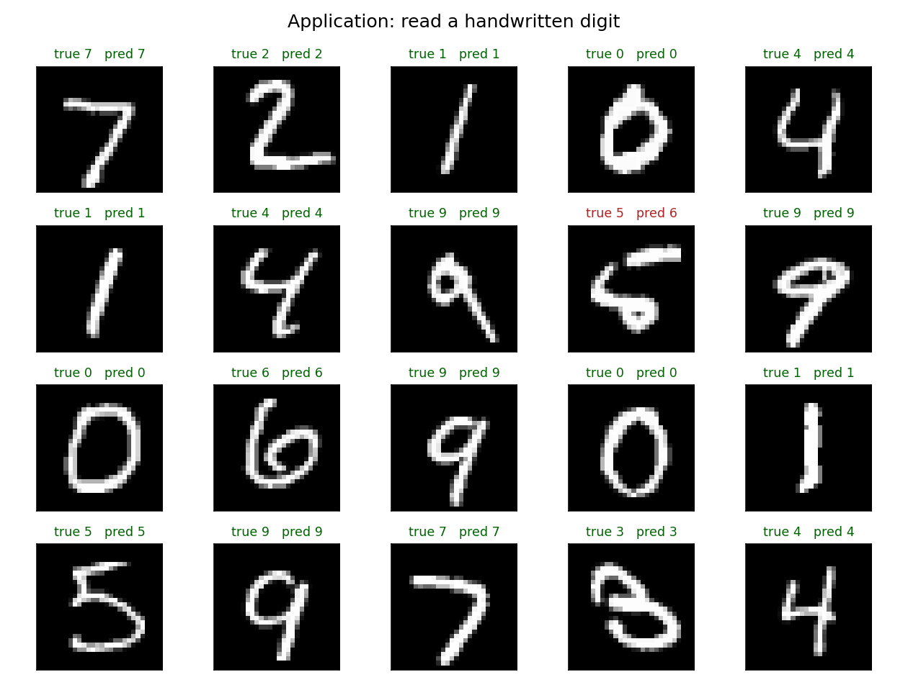
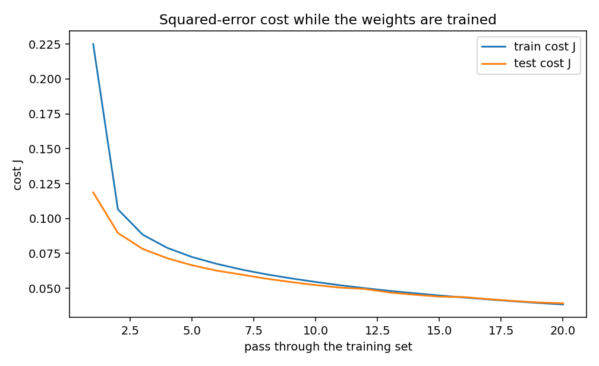

# Handwritten digit recognition

A feedforward network, trained from scratch with backpropagation, that reads handwritten digits. The implementation uses NumPy for the model and Matplotlib for the figures. On the public MNIST test set it reaches **95.49%** accuracy.



Green labels are correct readings. The red label is the one miss in this sample: a 5 read as a 6.

## Result

Training uses 60,000 images. The 10,000 test images are held out until evaluation.

| | Cost J | Accuracy |
|---|---:|---:|
| Before training, 1,000 test images | | 11.60% |
| Training set, after 20 passes | 0.0384 | 95.91% |
| Test set, after 20 passes | 0.0392 | 95.49% |

The test set has 451 mistakes out of 10,000. The cost falls through all 20 passes:



Saved weights, the numeric log, and both figures are in [`outputs/`](outputs).

## Dataset

The data is [MNIST](http://yann.lecun.com/exdb/mnist/), the public set of handwritten digits published by Yann LeCun, Corinna Cortes, and Christopher J. C. Burges. Each example is a 28×28 grayscale image of a digit from 0 to 9.

`python train.py` downloads the four official files, checks their MD5 checksums, and keeps them in `data/`. Those files are not committed.

| File | Contents |
|---|---|
| `train-images-idx3-ubyte.gz` | 60,000 training images |
| `train-labels-idx1-ubyte.gz` | 60,000 training labels |
| `t10k-images-idx3-ubyte.gz` | 10,000 test images |
| `t10k-labels-idx1-ubyte.gz` | 10,000 test labels |

## Run

```bash
python3 -m venv .venv
source .venv/bin/activate
pip install -r requirements.txt
python train.py
```

## Training procedure

The script follows nine steps. `train.py` runs them in this order.

**1. Data preparation.** Pixel values are divided by 255, so each input lies in [0, 1], and the image is flattened to 784 numbers. The label 3 becomes the target `[0, 0, 0, 1, 0, 0, 0, 0, 0, 0]`.

**2. Network architecture.** The network has 784 inputs, a hidden layer of 128 sigmoid units, and 10 sigmoid outputs, one per digit. A unit computes

```
z = (weights · inputs) + bias
a = 1 / (1 + exp(-z))
```

**3. Initialize parameters.** There are 101,770 weights and biases. Weights are small random values, scaled by `1/sqrt(fan-in)`. Biases start at 0. The learning rate is `alpha = 1.0`.

**4. Cost function.** The error of output unit `j` is `e_j = a_j - y_j`. The cost of one image is

```
J = (1/2) * sum_j e_j^2
```

On a batch, `J` is the mean of the per-image costs. Before training, the first image (a 5) has `J = 1.29`.

**5. Evaluation index.** Accuracy is the share of images whose largest output equals the true digit. Training minimizes `J`. The reported result is accuracy.

**6. Train the network.** Each update uses 128 images:

1. Forward pass, producing the prediction `a`.
2. Cost `J`.
3. Backpropagation, producing `dJ/dW = delta * a_previous^T`.
4. Weight update `W <- W - alpha * dJ/dW`. Biases use the same rule.

The analytic gradient matches a numerical derivative to a relative error of about `2e-8`. Training then makes 20 passes over the training set.

**7. Test the network.** The held-out 10,000 images give `J = 0.0392` and accuracy 95.49%.

**8. Store the parameters.** Weights and biases are written to `outputs/network_parameters.npz`.

**9. Use the trained network.** The file from step 8 is loaded and asked to read digits. That is the figure at the top of this page.

## Layout

```
train.py                  runs the nine steps
src/mnist_backprop/       dataset, forward pass, backpropagation
outputs/                  weights, metrics, and figures
```
